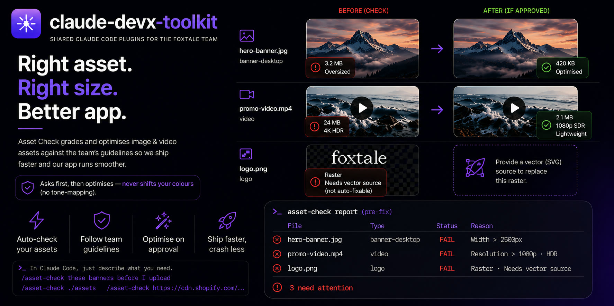
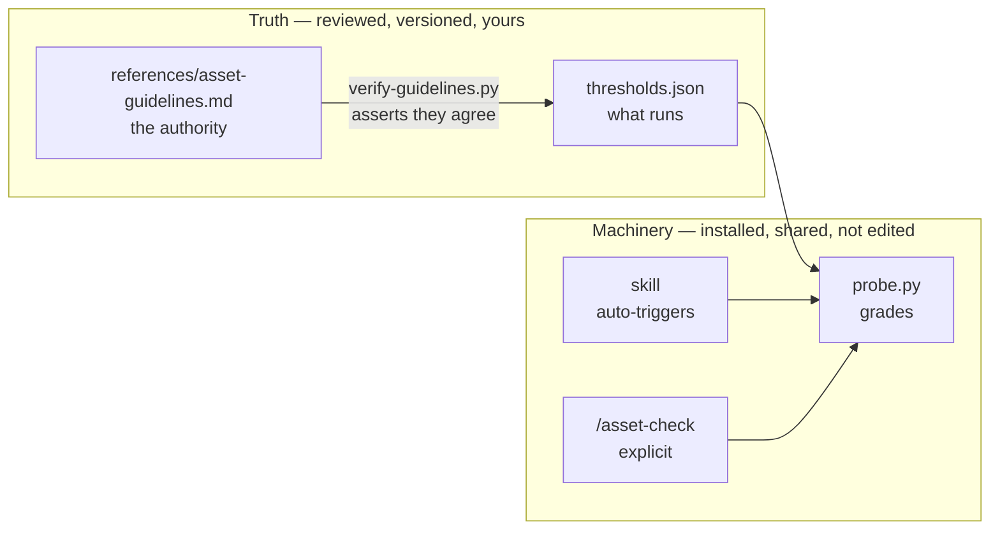
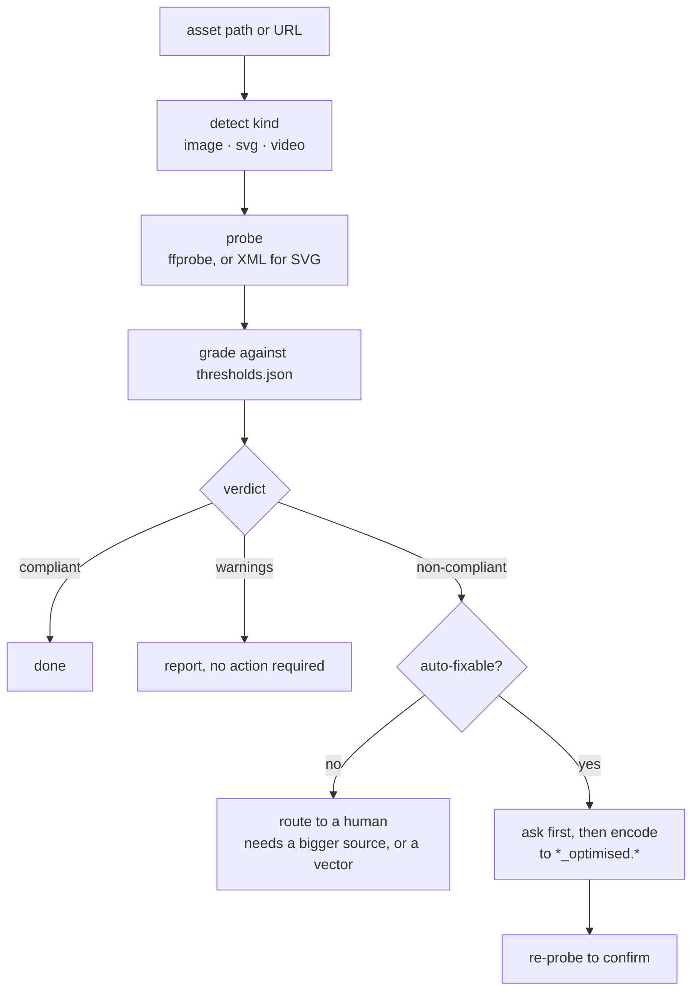

<div align="center">



# claude-devx-toolkit

Shared [Claude Code](https://claude.com/claude-code) plugins for the Foxtale team —
stop shipping 3 MB banners and videos that crash the app.

[](https://claude.com/claude-code)
[](https://ffmpeg.org)
[](#requirements)
[](#requirements)
[](LICENSE)

</div>

---

## What's in the box

| Plugin | What it does | Entry points |
|---|---|---|
| **`asset-check`** | Grades image and video assets against the team's published guidelines, then optimises the ones that fail. Catches oversized banners, raster icons that should be SVG, HDR/HEVC video that crashes the mobile app, and full-range colour that renders washed out on device. | auto-triggering skill · `/asset-check` · standalone CLI |

More plugins drop in as extra folders under `plugins/` — teammates pick them up with
`/plugin marketplace update`, with no re-onboarding.

---

## Quickstart

**1. Install ffmpeg** (once per machine — the only hard dependency)

```bash
brew install ffmpeg          # macOS
sudo apt install ffmpeg      # Debian / Ubuntu
```

**2. Add the marketplace** (once per machine)

```
/plugin marketplace add foxtale-data-product/claude-devx-toolkit
```

> Not published yet — until then, point it at your local clone:
> `/plugin marketplace add /Users/you/projects/claude-devx-toolkit`

**3. Install the plugin** (once per machine)

```
/plugin install asset-check@claude-devx-toolkit
```

**4. Use it** — just describe the problem, no command needed

```
these banners look heavy, can you check them before I upload
```

Confirm it landed with `/plugin` — `asset-check` should be listed as installed.

---

## Try it in 30 seconds

No assets to hand? Generate a deliberately non-compliant pair and watch it get caught:

```bash
cd plugins/asset-check/skills/asset-check

# a 2600 px banner (over the global width cap) and a 4K HDR video
ffmpeg -f lavfi -i "testsrc=size=2600x1000:d=1:r=1" -frames:v 1 hero-banner.jpg -y
ffmpeg -f lavfi -i "testsrc=size=3840x2160:d=1:r=30" -c:v libx264 -pix_fmt yuv420p \
  -colorspace bt2020nc -color_primaries bt2020 -color_trc arib-std-b67 hdr-4k.mp4 -y

python3 scripts/probe.py hero-banner.jpg hdr-4k.mp4
```

```
### hero-banner.jpg
kind: `image` · category: `banner-desktop`

| Check     | Requirement             | Actual  | Status |
|-----------|-------------------------|---------|--------|
| Width     | <= 2500 px (global cap) | 2600 px | FAIL   |
| File size | <= 1.00 MB              | 81 KB   | PASS   |
| Format    | JPG                     | JPG     | PASS   |

**Non-compliant**
- Width: Resize down to 2500 px.
```

---

## Two layers, like any good toolkit



**Machinery** is the same for everyone and updates centrally — you never edit the
installed copy. **Truth** is the guidelines: a markdown document your team owns, plus
the JSON the tooling enforces, held in sync by a script rather than by discipline.

---

## How a check runs



The **ask first** step is deliberate. Optimisation writes files and trades quality for
size — that call belongs to whoever owns the asset, not to the tool.

---

## Usage

### It triggers on its own

No command to remember. All of these reach it:

- *"check these banners before I upload them"*
- *"this hero image is 3 MB, can you sort it out"*
- *"why does this video look washed out on the phone"*
- *"what size should a mobile banner be"*

### Or call it explicitly

```
/asset-check ./assets/hero-banner.jpg
/asset-check https://cdn.shopify.com/s/files/.../banner.jpg
/asset-check                      # checks recently added assets
```

### Or skip Claude entirely

`probe.py` is a normal CLI with no dependencies beyond ffmpeg:

```bash
cd plugins/asset-check/skills/asset-check

python3 scripts/probe.py ~/Downloads/hero.jpg          # one asset
python3 scripts/probe.py ~/Downloads/*.jpg ~/*.mp4     # mixed, in one pass
python3 scripts/probe.py --category logo brand.png     # force a category
python3 scripts/probe.py --json assets/*               # machine-readable
python3 scripts/probe.py --list-categories
python3 scripts/probe.py --progress assets/*             # a line per asset as it finishes
```

`--progress` writes to stderr, one line per asset, so `--json` stdout stays clean:

```
[1/4] hero-banner.jpg — NON-COMPLIANT
[2/4] good-720p.mp4 — compliant
[3/4] ic-cart.svg — compliant
[4/4] nope.jpg — probe failed
```

Discrete lines rather than a spinner on purpose: inside a Claude Code tool call neither
stream is a TTY, so carriage-return animation is captured verbatim instead of rendered —
every frame would collapse onto one unreadable line. In the terminal the moving
indicator you see is Claude Code's own spinner, which the skill drives with task labels
like *"Optimising promo-video.mp4 (3 of 5)"*.

| Exit code | Meaning |
|---|---|
| `0` | every asset compliant |
| `1` | at least one non-compliant |
| `2` | a probe failed, **or a check could not be verified** |

`1` outranks `2`: a definite non-compliance is never masked by an unreadable file in
the same run.

That last case matters. Remote video sometimes arrives without its colour metadata, so
HDR genuinely cannot be determined — those checks report `UNKN` and the verdict is
**Could not fully verify**, never "compliant". A gate should stop on `2` rather than
read silence as approval; download the file and re-probe it locally for a real answer.

Which makes it easy to gate CI or a pre-commit hook:

```bash
assets=$(git diff --cached --name-only --diff-filter=ACM \
  | grep -iE '\.(jpg|jpeg|png|webp|svg|mp4|mov)$' || true)

# Guard the empty case: probe.py exits 2 when given no arguments, so an
# unguarded call would fail every commit that touches no assets.
[ -z "$assets" ] || python3 scripts/probe.py $assets
```

---

## What it checks

**Images** — width against a per-category minimum *and* maximum, file size, and format.
Categories are inferred from the filename, or forced with `--category`:

| Key | Use case |
|---|---|
| `product-image` | PDP main / zoom |
| `product-thumbnail` | Listing / grid |
| `banner-desktop` | Collection, homepage, promo banners |
| `banner-mobile` | Mobile banners, all types |
| `background` | Section backgrounds |
| `icon-ui` | Buttons, small icons |
| `icon-illustrative` | Feature icons |
| `logo` | Brand logos |
| `misc` | Anything else |

**Video** — resolution, codec, bitrate, frame rate, pixel format, colour space, HDR, and
container. Every video limit is a maximum; lower is always fine.

**The actual numbers live in one place: [`references/asset-guidelines.md`](plugins/asset-check/skills/asset-check/references/asset-guidelines.md).**
They are deliberately not repeated here — a third copy is a third thing to forget to
update.

---

## Brand-specific rules

The bundled thresholds are the team baseline. A brand or project can differ from it
without editing the plugin and without a PR — tell the skill your rule and it writes it
to `.asset-check.json` in your project, where it applies on every future run:

```json
{
  "_comment": "Editorial heroes are shot wide; 2500 px crops the composition.",
  "global": { "hard_max_width_px": 3000 },
  "image_categories": {
    "banner-desktop": { "max_width_px": 3000 },
    "lookbook": { "max_width_px": 1200, "max_bytes": 409600, "preferred_format": "jpg" }
  },
  "filename_hints": { "lookbook": ["lookbook", "editorial"] },
  "notes": "Our CDN strips EXIF on upload, so don't bother stripping it locally."
}
```

Config layers, later winning:

| Layer | Path | Scope |
|---|---|---|
| team | bundled `thresholds.json` | everyone — change via PR |
| user | `~/.claude/asset-check/config.json` | you, every project |
| project | `.asset-check.json` (found by walking up) | that repo, everyone in it |

```bash
python3 scripts/probe.py --show-config        # what's active and what it changed
python3 scripts/probe.py --no-overrides ...   # grade against the team baseline (CI)
```

Four properties that keep this from becoming a way to quietly lower the bar:

- **Overrides are always disclosed** — in the report and in `--json`. A pass reached via
  local config never looks like a pass against the team standard.
- **`--no-overrides` ignores them entirely**, so CI can gate on the shared baseline no
  matter what a project set.
- **Config that couldn't take effect is rejected**, not half-applied. Raising a category
  above the global width cap errors out and names the global value to raise.
- **They live outside the plugin**, so `/plugin marketplace update` can't wipe them —
  which is exactly what happened to the older "edit my own instructions" approach.

Full schema and worked examples:
[`references/customising.md`](plugins/asset-check/skills/asset-check/references/customising.md).

---

## What it deliberately won't do

Each of these is a case where doing the obvious thing produces a worse asset:

| It won't | Because |
|---|---|
| **Upscale** an undersized image | That is the specific thing the minimums exist to prevent. Reported as non-compliant and *not auto-fixable* — it needs a larger source. |
| **Vectorise** a raster icon or logo | Nothing can turn a PNG into a real SVG. Auto-tracing looks worse than the PNG did, so it asks for the vector instead. |
| **Tone map** HDR video | It desaturates badly and is irreversible. HDR is scaled and retagged to bt709, which preserves the original colour — HLG is already SDR-compatible, only the metadata is wrong. |
| **Compress** its way out of a size problem | An oversized image is oversized because of its *dimensions*. It resizes first, then compresses. |
| **Overwrite** your originals | Output always goes to `<name>_optimised.<ext>`. The original is the only thing a retry can start from. |

---

## Requirements

**Required:** `ffmpeg`, `ffprobe`, `python3`. That's it — no `pip install`, the scripts are
stdlib only.

**Optional:** ImageMagick for marginally better resampling, `cwebp` for WebP output.
Neither is required; ffmpeg covers resize, recompression and PNG→JPG flattening on its
own.

```bash
brew install imagemagick webp          # macOS
sudo apt install imagemagick webp      # Debian / Ubuntu
```

Check any machine:

```bash
bash plugins/asset-check/skills/asset-check/scripts/check-deps.sh
```

```
  ffprobe      present        ffprobe version 8.1
  ffmpeg       present        ffmpeg version 8.1
  python3      present        Python 3.13.7

  ImageMagick  absent         optional — ffmpeg handles resize/compress/flatten instead
  cwebp        present        WebP encoding available
  ffmpeg webp  absent         this ffmpeg build cannot write WebP — use cwebp
```

> Many ffmpeg builds — current Homebrew included — ship **without** the WebP encoder.
> The dep check detects this, and WebP output routes through `cwebp`.

No macOS-only tools are used, so this works the same on Linux and WSL.

---

## Source of truth

[`references/asset-guidelines.md`](plugins/asset-check/skills/asset-check/references/asset-guidelines.md) is the **human-readable
authority** — the categories, the mandatory rules, the video table, and the reasoning
behind each. `thresholds.json` is the machine-readable copy the tooling enforces.

Rather than trusting anyone to keep two files in step, the agreement is checked:

```bash
python3 plugins/asset-check/skills/asset-check/scripts/verify-guidelines.py
# thresholds.json matches asset-guidelines.md (9 image categories, 8 video settings, 6 mandatory rules)
```

It compares every category's minimum, preferred range, maximum width, hard cap,
preferred and maximum file size and format; every video setting; the mandatory-rule
count; and the global caps — exiting `1` with a precise diff on any mismatch. Worth
wiring into CI.

**Why the limits exist** matters as much as the limits: consistent quality across web
and mobile, faster loading, **lower mobile-app memory use — the direct cause of the
crashes and lag these rules prevent**, maintainable asset management, and efficient use
of Shopify's limited storage. Quote the reason when asking someone to change an asset;
it lands better than a number.

---

## Repo layout

```
claude-devx-toolkit/
├── .claude-plugin/
│   └── marketplace.json              # marketplace manifest — lists the plugins
├── docs/
│   └── asset-guidelines.md           # ← the guidelines (authority)
├── plugins/
│   └── asset-check/
│       ├── .claude-plugin/plugin.json
│       ├── commands/
│       │   └── asset-check.md        # /asset-check
│       └── skills/asset-check/
│           ├── SKILL.md              # workflow (auto-triggering)
│           ├── references/
│           │   ├── thresholds.json   # ← the limits (enforced)
│           │   ├── image-fixes.md    # resize, recompress, PNG→JPG, WebP
│           │   └── video-fixes.md    # bitrate, full-range, HDR, HEVC, remux
│           └── scripts/
│               ├── probe.py              # probe + grade
│               ├── check-deps.sh         # dependency preflight
│               └── verify-guidelines.py  # doc ↔ JSON drift check
├── CONTRIBUTING.md
└── README.md
```

---

## Updating

**As a user** — pull the latest plugins:

```
/plugin marketplace update claude-devx-toolkit
```

**As a maintainer** — bump `version` in *both* `.claude-plugin/marketplace.json` and
`plugins/asset-check/.claude-plugin/plugin.json`, then merge. `claude plugin tag`
validates that the two agree before you cut a release.

---

## FAQ

<details>
<summary><strong>Do I need ImageMagick?</strong></summary><br>

No. Every image fix has a working ffmpeg path — resize, recompress, and PNG→JPG
flattening included. ImageMagick is a nice-to-have for slightly better resampling.
</details>

<details>
<summary><strong>It didn't trigger automatically.</strong></summary><br>

Use `/asset-check` explicitly. If the name collides with another command — a personal
one in `~/.claude/commands/`, say — the namespaced form always resolves to this plugin:
`/asset-check:asset-check`.
</details>

<details>
<summary><strong>Will it overwrite my assets?</strong></summary><br>

No. Output goes to `<name>_optimised.<ext>` alongside the original, and it asks before
encoding anything.
</details>

<details>
<summary><strong>My icon is fine but it failed on format.</strong></summary><br>

SVG is mandatory for icons and logos, not merely preferred, so a PNG icon fails even at
a perfect size. It is marked *not auto-fixable* because auto-tracing a raster to SVG
produces worse output than the PNG — ask the designer for the vector, which will exist
in the source file.
</details>

<details>
<summary><strong>My 1080p video got flagged.</strong></summary><br>

As a **warning**, not a failure — 1080p is within limits, 720p is simply lighter. No
action needed. Warnings never make an asset non-compliant.
</details>

<details>
<summary><strong>How do I change a limit?</strong></summary><br>

Edit [`references/asset-guidelines.md`](plugins/asset-check/skills/asset-check/references/asset-guidelines.md), update `thresholds.json`,
then run `verify-guidelines.py` — it tells you precisely what still disagrees. See
[CONTRIBUTING.md](CONTRIBUTING.md).
</details>

<details>
<summary><strong>Can I run it without Claude?</strong></summary><br>

Yes — `probe.py` is a plain CLI with meaningful exit codes. See
[Usage](#or-skip-claude-entirely).
</details>

<details>
<summary><strong>Making the repo private — does anything change?</strong></summary><br>

No. The install commands are identical; `/plugin marketplace add` uses each teammate's
own git credentials, so they just need read access to the repo.
</details>

---

## Tests

```bash
python3 tests/test_asset_check.py
```

21 regression tests, stdlib `unittest`, fixtures generated on the fly with ffmpeg — no
binaries committed. Each test pins a bug that was found and fixed, several of which
produced output that looked entirely reasonable while being wrong (a remote HDR video
reported as SDR; `width="100%"` read as 100 px; a portrait photo graded on its stored
landscape dimensions). Run it before any PR.

---

## Contributing

Fixes, new categories, and threshold changes go through a PR — see
[CONTRIBUTING.md](CONTRIBUTING.md).

Editing an *installed* plugin does nothing: the cache is overwritten on the next update
and no teammate ever sees the change. The repo is the only place a fix survives.

## Publishing

```bash
cd claude-devx-toolkit
gh repo create foxtale-data-product/claude-devx-toolkit --private --source=. --push
```

Then swap the placeholder in [Quickstart](#quickstart) for the real repo path.

<div align="center"><sub>MIT · Foxtale DevX</sub></div>
